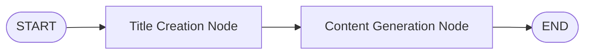
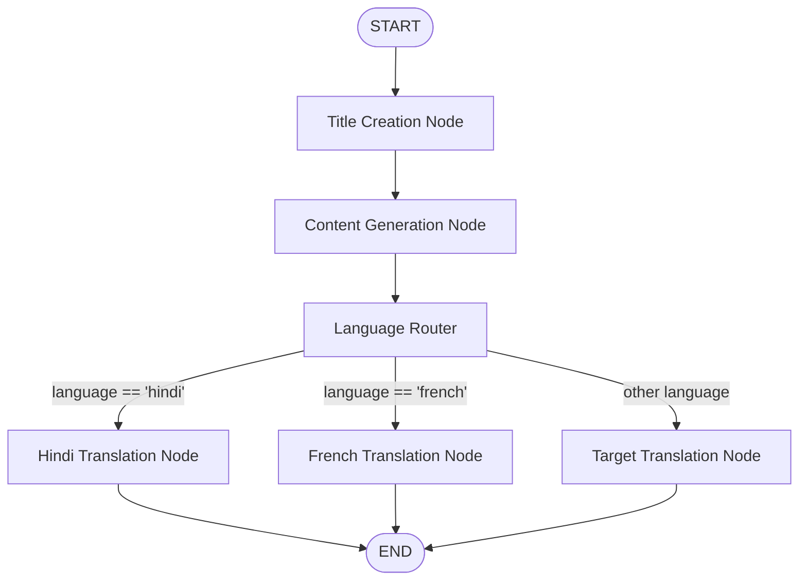

# 🚀 BlogAgentic AI

[](https://www.python.org/)
[](https://www.langchain.com/langgraph)
[](https://groq.com/)
[](https://fastapi.tiangolo.com/)
[](LICENSE)

**BlogAgentic AI** is an advanced, production-grade agentic AI blog generation and multi-lingual translation engine built with **LangGraph**, **LangChain**, **Groq Llama / GPT-OSS models**, and **FastAPI**. 

It leverages graph-based state machine architecture to orchestrate autonomous blog creation—from creative SEO title generation and detailed markdown article writing to intelligent multi-lingual conditional translation routing (e.g., Hindi, French).

---

## 🌟 Key Features

- **🤖 Autonomous Graph Workflows**: Dynamic execution paths managed by **LangGraph StateGraph**.
- **⚡ High-Speed LLM Inference**: Powered by **ChatGroq** (`openai/gpt-oss-120b`) for rapid generation.
- **🔀 Intelligent Conditional Routing**: Router node evaluates desired target languages and conditionally dispatches jobs to specialized translation nodes.
- **🛡️ Deterministic Structured Outputs**: Strict validation of blog schema (`title`, `content`) using **Pydantic** and JSON mode parsing.
- **🌐 FastAPI REST Service**: Sleek API server endpoint (`/blogs`) supporting single-topic blog creation and direct translation requests.
- **📊 LangGraph Studio & LangSmith Integration**: Out-of-the-box support for visual graph debugging with `langgraph.json` and LangSmith tracing.
- **⚡ Modern Project Tooling**: Native compatibility with **`uv`** package manager and standard `requirements.txt`.

---

## 🏗️ Architecture & Workflow

The core agent operates as a stateful graph driven by the `BlogState` context object.

### 1. Topic-Only Generation Workflow


### 2. Multi-Lingual Translation Workflow


---

## 📁 Project Structure

```
BlogAgentic/
├── app.py                      # FastAPI REST API application & endpoints
├── langgraph.json              # LangGraph CLI & Studio configuration
├── pyproject.toml              # Project metadata & dependency definitions
├── requirements.txt            # Package dependencies list
├── request.json                # Sample API request payloads
├── .env                        # Environment variables (API keys)
└── src/
    ├── graphs/
    │   └── graph_builder.py    # LangGraph StateGraph constructor & routing logic
    ├── llms/
    │   └── groqllm.py          # Groq LLM initialization & wrapper
    ├── nodes/
    │   └── blog_node.py        # Core agent node implementations (Title, Content, Translate, Route)
    └── states/
        └── blogstate.py        # Pydantic schemas (Blog) & LangGraph state (BlogState)
```

---

## 🛠️ Installation & Setup

### Prerequisites
- **Python 3.12+**
- **Groq API Key**: [Get your Groq API Key](https://console.groq.com/)
- *(Optional)* **LangChain API Key**: [Get your LangSmith Key](https://smith.langchain.com/) for observability

### 1. Clone the Repository
```bash
git clone https://github.com/simplyhemant/BlogAgentic-AI.git
cd BlogAgentic-AI
```

### 2. Set Up Virtual Environment

Using standard Python `venv`:
```bash
python -m venv .venv
source .venv/bin/activate  # On Windows: .venv\Scripts\activate
pip install -r requirements.txt
```

Or using **`uv`** (Faster package manager):
```bash
uv sync
source .venv/bin/activate
```

### 3. Environment Variables Configuration

Create a `.env` file in the project root:

```ini
# Groq API Configuration
GROQ_API_KEY=your_groq_api_key_here

# LangSmith Observability (Optional)
LANGCHAIN_TRACING_V2=true
LANGCHAIN_API_KEY=your_langchain_api_key_here
LANGCHAIN_PROJECT=BlogAgentic-AI
```

---

## 🚀 Running the Application

### Option 1: FastAPI REST Server
Start the development server with live reload:
```bash
python app.py
```
Or directly via Uvicorn:
```bash
uvicorn app:app --host 0.0.0.0 --port 8000 --reload
```
The server will start at `http://localhost:8000`. API documentation is available at `http://localhost:8000/docs`.

### Option 2: LangGraph Studio / CLI
Visualize and interactively debug the graph state machine:
```bash
langgraph dev
```

---

## 📡 API Endpoint Usage

### `POST /blogs`

Generates a blog post given a topic and optional target language.

#### Example 1: Topic-Only Generation (English)
**Request:**
```bash
curl -X POST "http://localhost:8000/blogs" \
     -H "Content-Type: application/json" \
     -d '{
           "topic": "Agentic AI in Enterprise Workflows"
         }'
```

**Response:**
```json
{
  "data": {
    "topic": "Agentic AI in Enterprise Workflows",
    "blog": {
      "title": "Unlocking Enterprise Efficiency: The Rise of Agentic AI",
      "content": "# Unlocking Enterprise Efficiency: The Rise of Agentic AI\n\nAgentic AI is shifting automated workflows..."
    }
  }
}
```

#### Example 2: Multi-Lingual Generation (French / Hindi)
**Request:**
```bash
curl -X POST "http://localhost:8000/blogs" \
     -H "Content-Type: application/json" \
     -d '{
           "topic": "Agentic AI in Enterprise Workflows",
           "language": "french"
         }'
```

---

## ⚙️ How It Works (Deep Dive)

1. **State Initialization (`BlogState`)**:
   Holds the state variables passed across nodes: `topic`, `blog` (`title` & `content`), and `current_language`.
2. **Title Node (`title_creation`)**:
   Crafts a high-impact, SEO-friendly headline formatted in Markdown.
3. **Content Node (`content_generation`)**:
   Expands the topic and title into a comprehensive, structured Markdown article.
4. **Conditional Router (`route_decision`)**:
   Inspects `current_language`. If a target language is supplied (e.g., `"french"` or `"hindi"`), it dynamically routes state to the appropriate translation node using structured JSON mode extraction (`with_structured_output(Blog, method="json_mode")`).

---

## 🗺️ Roadmap & Future Improvements

- [ ] Add web search integration (Tavily / DuckDuckGo) for real-time factual grounding.
- [ ] Implement an automated SEO optimization & Keyword density reviewing node.
- [ ] Add support for social media post summary nodes (LinkedIn/Twitter snippets).
- [ ] Support human-in-the-loop review nodes before final publishing.

---

## 🤝 Contributing

Contributions are welcome! Feel free to open issues or submit pull requests.

1. Fork the Project
2. Create your Feature Branch (`git checkout -b feature/AmazingFeature`)
3. Commit your Changes (`git commit -m 'Add some AmazingFeature'`)
4. Push to the Branch (`git push origin feature/AmazingFeature`)
5. Open a Pull Request

---

## 👤 Author

**Hemant Singh**
- GitHub: [@simplyhemant](https://github.com/simplyhemant)

---

## 📄 License

Distributed under the MIT License. See `LICENSE` for more information.
